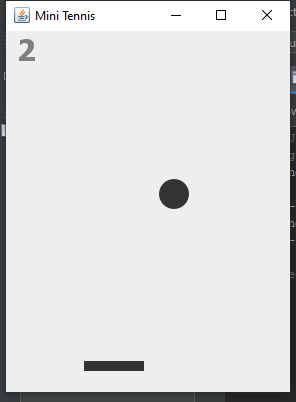

# Juego de Minitenis en Java

## Descripción

Este es un sencillo juego de minitenis desarrollado en Java. El objetivo del juego es golpear la pelota con la raqueta para que no toque el suelo. El juego cuenta con controles para mover la raqueta, una pelota que se mueve por la pantalla, y un contador de puntuación. La dificultad del juego aumenta a medida que la pelota va rebotando.



## Características

- **Gráficos sencillos**: Dibujos básicos de la raqueta y la pelota.
- **Controles del teclado**: Mueve la raqueta usando las teclas de dirección.
- **Detección de colisiones**: La pelota rebota al golpear la raqueta y los bordes de la ventana.
- **Aumento de dificultad**: La velocidad de la pelota aumenta a medida que va rebotando.
- **Contador de puntuación**: Lleva un registro de la puntuación del jugador.

## Requisitos

- Java Development Kit (JDK) 8 o superior.
- Un entorno de desarrollo integrado (IDE) como IntelliJ IDEA, Eclipse, o NetBeans.

## Instalación

1. **Clona el repositorio**:
    ```sh
    git clone [https://github.com/tu-usuario/juego-minitenis.git](https://github.com/Jgmdevelopers/minitenis.git)
    ```

2. **Navega al directorio del proyecto**:
    ```sh
    cd juego-minitenis
    ```

3. **Compila el código**:
    ```sh
    javac Game.java
    ```

4. **Ejecuta el juego**:
    ```sh
    java Game
    ```

## Cómo jugar

- **Mover la raqueta**: Usa las teclas de flecha izquierda y derecha para mover la raqueta.
- **Objetivo**: Mantén la pelota en juego el mayor tiempo posible evitando que toque el suelo.
- **Puntuación**: Cada vez que la pelota rebota en la raqueta, ganas un punto.
- **Dificultad**: La velocidad de la pelota aumenta a medida que consigues más rebotes.

## Código Fuente

El código fuente principal se encuentra en el archivo `Game.java`.

```java
// Ejemplo de código (fragmento)
public class Game extends JFrame {

    private int ballX = 160;
    private int ballY = 240;
    private int ballDirectionX = 1;
    private int ballDirectionY = 1;
    private int paddleX = 160;
    private int score = 0; // Contador de puntuación
    private int speed = 10; // Velocidad inicial

    public Game() {
        setTitle("Minitenis");
        setSize(400, 400);
        setResizable(false);
        setDefaultCloseOperation(EXIT_ON_CLOSE);
        setVisible(true);
    }

    public void paint(Graphics g) {
        super.paint(g);
        g.fillRect(ballX, ballY, 10, 10);
        g.fillRect(paddleX, 350, 60, 10);
        g.drawString("Score: " + score, 10, 10);
    }

    public void moveBall() {
        ballX += ballDirectionX;
        ballY += ballDirectionY;

        // Lógica de rebote
        if (ballX < 0 || ballX > getWidth() - 10) {
            ballDirectionX = -ballDirectionX;
        }
        if (ballY < 0) {
            ballDirectionY = -ballDirectionY;
        }
        if (ballY > 340 && ballX > paddleX && ballX < paddleX + 60) {
            ballDirectionY = -ballDirectionY;
            score++;
            speed--; // Aumentar dificultad
        }
        if (ballY > getHeight()) {
            // Fin del juego
            ballX = 160;
            ballY = 240;
            score = 0;
            speed = 10;
        }
    }

    public static void main(String[] args) {
        Game game = new Game();
        while (true) {
            game.moveBall();
            game.repaint();
            try {
                Thread.sleep(game.speed);
            } catch (InterruptedException e) {
                e.printStackTrace();
            }
        }
    }
}
##Contribuciones
- **¡Las contribuciones son bienvenidas! Si tienes alguna mejora o corrección, no dudes en hacer un fork del proyecto y enviar un pull request.
